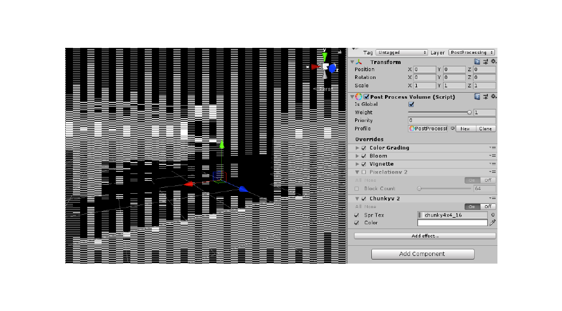
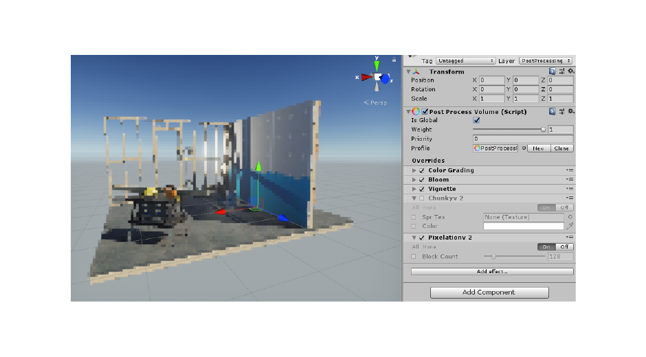

# Unity-Pixelation-v2

Unity [Pixelation Package](https://assetstore.unity.com/packages/vfx/shaders/fullscreen-camera-effects/pixelation-65554) - Converted to PostProcessing v2 effect 🥂👓

I wanted to use Dmitry's awesome Pixelation shaders, but with the new [PostProcessing Stack](https://github.com/Unity-Technologies/PostProcessing).
Naturally this required a few modifications, which I've included in this repository.

## To Use

+ Import the `Pixelation` Directory into Unity 5.6.1+
+ Import [PostProcessing](https://github.com/Unity-Technologies/PostProcessing/wiki/Installation)
+ Add the effects to a PostProcessing Volume

## License

The Initial package isn't mine to License. However, my modifications are MIT licensed.
